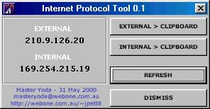



## IP Tool v0\.1

### Description

Here's a little app I made to display both your IP addresses...both Internal(LAN) and External(Public) IPs. That's assuming you have a net connection active and a Local Network IP for your machine. If not It'll show you the type of IP and display it below. Allows you to refresh and copy IPs to clipboard. Very handy for gamers of internet app programmers.

NOTE: I've made sure that IPs are show correctly to be either External or Local, but there *might* be a bug or two I've overlooked. Comments are welcome. My ICQ# - 34851120 (require auth - just let me know you saw this post)

Winsock Code Originally Written by |Danger| - thanx dude!
 
### More Info
 

             |
---                |---
**Submitted On**   |2000-05-31 17:25:50
**By**             |[John Pettit](https://github.com/Planet-Source-Code/PSCIndex/blob/master/ByAuthor/john-pettit.md)
**Level**          |Intermediate
**User Rating**    |4.7 (52 globes from 11 users)
**Compatibility**  |VB 5\.0, VB 6\.0
**Category**       |[Complete Applications](https://github.com/Planet-Source-Code/PSCIndex/blob/master/ByCategory/complete-applications__1-27.md)
**World**          |[Visual Basic](https://github.com/Planet-Source-Code/PSCIndex/blob/master/ByWorld/visual-basic.md)
**Archive File**   |[CODE\_UPLOAD62515312000\.zip](https://github.com/Planet-Source-Code/john-pettit-ip-tool-v0-1__1-8482/archive/master.zip)

